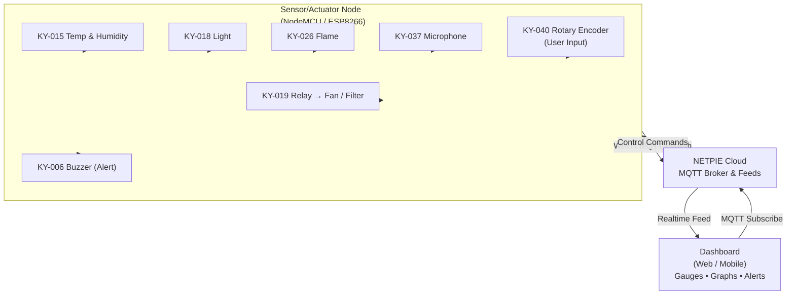
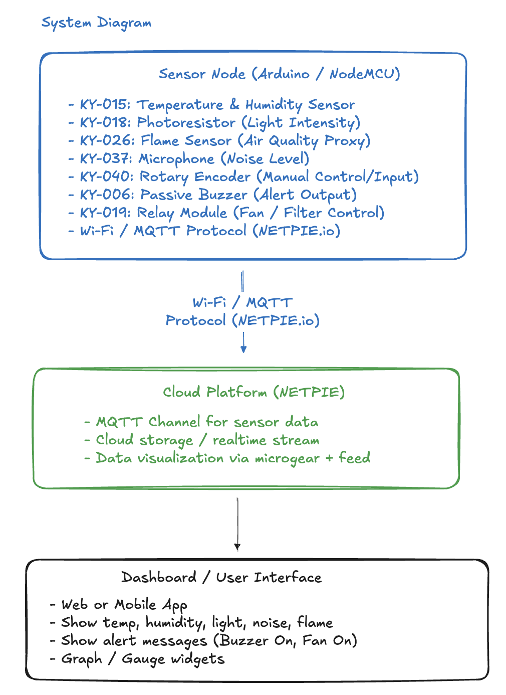
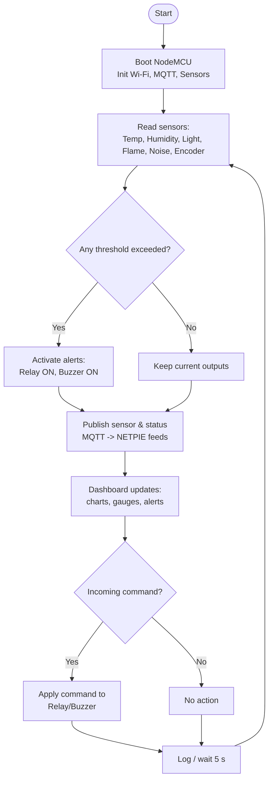
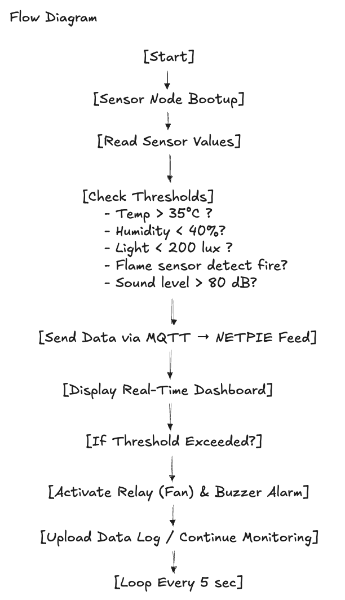

## 🌎 **Smart Air Quality & Environment Monitor System**

### 🎯 **Objective**

ระบบตรวจวัดคุณภาพอากาศและสิ่งแวดล้อมแบบเรียลไทม์ สามารถแจ้งเตือนเมื่อค่ามลพิษเกินระดับที่กำหนด และแสดงผลบน Dashboard (NETPIE)

---

## 🧭 **System Diagram**






## 🔄 Flow Diagram







---

## 🔧 **รายชื่อ Sensor / Module ที่ใช้**

| ลำดับ | Module                       | Function                               | Type         |
| ----- | ---------------------------- | -------------------------------------- | ------------ |
| 1     | **KY-015**                   | วัดอุณหภูมิและความชื้น                 | Sensor       |
| 2     | **KY-018**                   | วัดความเข้มของแสง                      | Sensor       |
| 3     | **KY-026**                   | ตรวจจับเปลวไฟ / ความร้อน               | Sensor       |
| 4     | **KY-037**                   | ตรวจระดับเสียงรบกวน (Noise Level)      | Sensor       |
| 5     | **KY-040**                   | ใช้ปรับ Threshold หรือ input จากผู้ใช้ | Input Device |
| 6     | **KY-006**                   | แจ้งเตือนด้วยเสียง (Buzzer)            | Actuator     |
| 7     | **KY-019**                   | ควบคุมพัดลมหรือไฟฟ้า (Relay Output)    | Actuator     |
| 8     | **NodeMCU / ESP8266**        | สื่อสารกับ Cloud (NETPIE)              | Controller   |
| 9     | **NETPIE.io Cloud Platform** | Dashboard + MQTT Broker                | Cloud        |

---

## 👥 **การแบ่งหน้าที่ทีม (4 คน)**

| ชื่อบทบาท                      | หน้าที่                                   | รายละเอียด                                              |
| ------------------------------ | ----------------------------------------- | ------------------------------------------------------- |
| 🧠 **System Architect**        | ออกแบบโครงสร้างระบบและการเชื่อมต่อ NETPIE | วาด Diagram, กำหนดการเชื่อม NodeMCU ↔ Sensors ↔ Cloud |
| 💻 **Embedded Developer**      | เขียนโค้ดบน NodeMCU (C/C++ / Arduino IDE) | อ่านค่า Sensor, ควบคุม Relay/Buzzer, ส่งข้อมูลผ่าน MQTT |
| 🎨 **UI/UX & Cloud Developer** | ออกแบบ Dashboard NETPIE / Web interface   | ตั้งค่า feed, create widget, สร้าง graph และแจ้งเตือน   |
| 📋 **Team Manager / Tester**   | ทดสอบระบบและจัดทำรายงาน                   | ตรวจค่า sensor จริง, จัดการเวลา, เตรียมสไลด์และ present |

---

## 📊 **ตัวอย่าง Dashboard บน NETPIE**

**Dashboard Layout Suggestion:**

| Widget               | Display               | Function                   |
| -------------------- | --------------------- | -------------------------- |
| 🌡️ Temperature Gauge | Real-time Temp (°C)   | แสดงอุณหภูมิปัจจุบัน       |
| 💧 Humidity Gauge    | Real-time RH (%)      | ความชื้นสัมพัทธ์           |
| ☀️ Light Meter       | lux value (Bar graph) | ความเข้มแสง                |
| 🔥 Flame Indicator   | LED On/Off            | สถานะตรวจจับไฟ             |
| 🔊 Sound Level Meter | dB Value              | เสียงรบกวน                 |
| 🌀 Fan Status        | Toggle Switch         | สั่งเปิด/ปิดรีเลย์         |
| 🔔 Alert             | Notification Widget   | แจ้งเตือนเมื่อค่าเกินกำหนด |

**ตัวอย่าง UI NETPIE Feed Structure:**

```
/airquality/temp
/airquality/humidity
/airquality/light
/airquality/flame
/airquality/sound
/airquality/fan_status
/airquality/alert
```

---

## 🚀 **ฟีเจอร์เสริม (ถ้ามีเวลาเพิ่ม)**

- เพิ่ม **AI Decision Rule** เช่น คำนวณ “Air Quality Index (AQI)” จากหลาย sensor
- เพิ่ม **Data Logging ผ่าน SD Card Module**
- เพิ่ม **LINE Notify Integration** ผ่าน Node.js / MQTT Bridge
- ทำ **Mobile-Friendly Dashboard** ผ่าน NETPIE REST API
